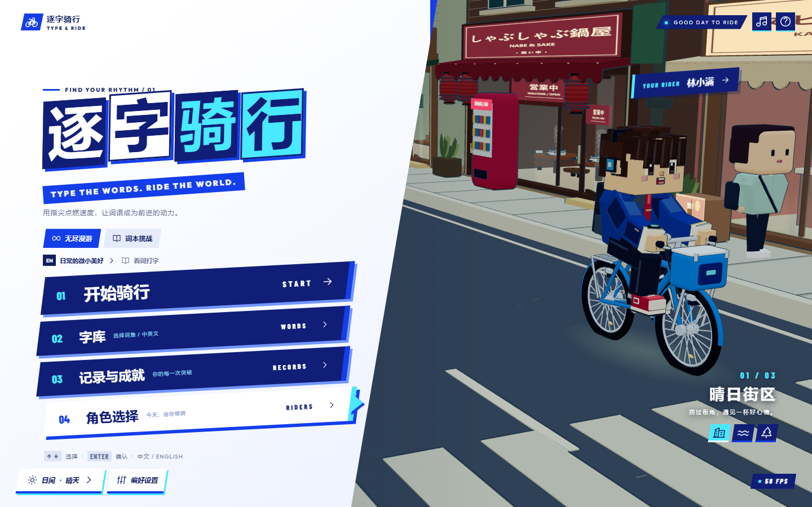
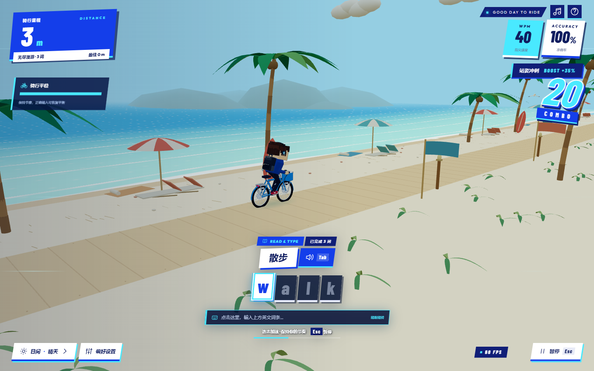
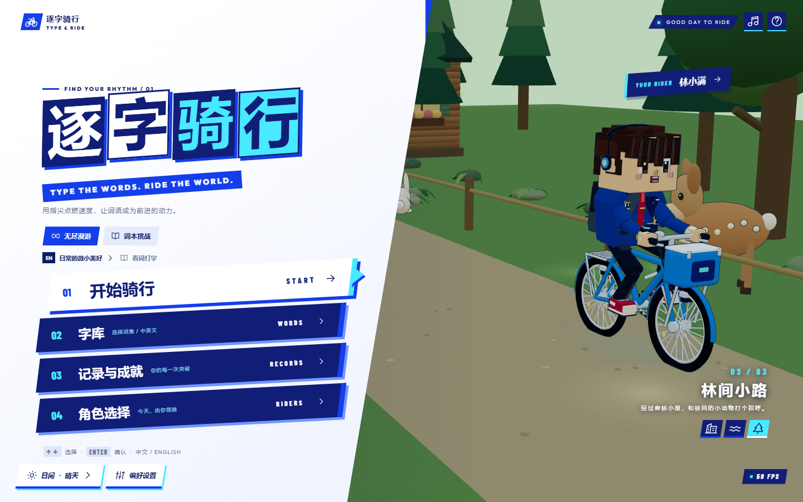
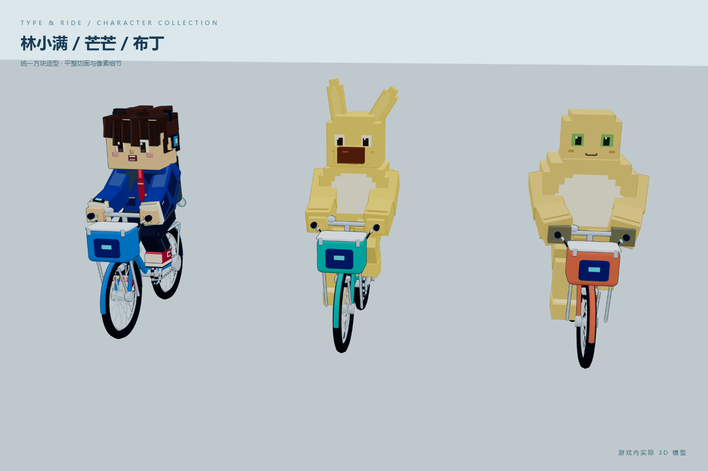

# Typing-Ride · 逐字骑行

用指尖点燃速度，让词语成为前进的动力。

**Typing-Ride** 是一款中英文打字骑行游戏，使用 TypeScript、Three.js 和 Vite，在浏览器中运行。输入正确字符推动自行车前进，连续失误会让骑手失去平衡；达到一定打字速度后，角色站起来冲刺。



## 游戏特色

- **中英文输入**：英文字符逐字判定；中文支持输入法组词，提交的汉字才参与判定。
- **无尽漫游 / 词本挑战**：挑战骑行距离，或按章节完成目标词语。
- **看词 / 听力打字**：直接输入目标，或通过浏览器语音朗读进行听写。
- **速度驱动骑行**：即时打字速度影响行进速度。达到 40 WPM 后触发站姿冲刺、35% 加速和镜头反馈；中文阈值使用字 / 分。
- **输入反馈**：键帽动画、粒子、连击、音效和失误晃动，出发前有 3、2、1、GO 倒计时。
- **三张地图与动态天气**：晴日街区、海风来信、林间小路；支持日间、黄昏、夜晚及晴天、雨天、雪天。
- **三位方块角色**：林小满、芒芒和布丁，在菜单里可切换预览。
- **字库与成就**：内置 140 个中英文词条，支持自定义词本、易错词回顾、本地记录和 JSON 导出。
- **原创合成音频**：使用 Web Audio 实时生成音乐、环境声和交互音效。

## 游戏画面

**晴日街区**包含奶茶、锅物、书店、唱片 / CD 店、电影院、便利店、拉面和面包店。开放店面里可以看到柜台、店员、书架、唱片和锅物蒸汽；街上有汽车穿行与行人走动，雨天路人撑伞。

**海风来信**沿沙滩旁的木质小路骑行，配有白沙、海浪、椰树、海岛、遮阳伞和冲浪板。



**林间小路**包含密林、原木小屋、蕨类、蘑菇，以及会活动的鹿、兔子和松鼠。





`previews/` 保存了开发过程中不同版本的实机截图与短片。运行项目后，访问 `/previews/` 可以浏览预览画廊。

## 快速开始

需要 **Node.js 22 或更新版本**和 **pnpm**。

```sh
git clone https://github.com/LLLimit/Typing-Ride.git
cd Typing-Ride
pnpm install --frozen-lockfile
pnpm dev
```

在浏览器打开终端显示的地址，默认为 **http://127.0.0.1:5173/**。该端口需要未被其他程序占用。

### 构建与运行

```sh
pnpm build
pnpm preview
```

构建生成的 `dist/` 可部署到静态网站服务器。请通过 HTTP 服务打开游戏，直接双击 HTML 无法正确加载模块。

Windows 用户完成安装和构建后，也可以双击 **`开始游戏.cmd`**。它会启动本机服务器并打开浏览器；保持启动窗口开启，按 Ctrl+C 停止服务。仓库不包含构建产物，首次运行需要先执行 `pnpm build`。

## 操作说明

| 操作 | 功能 |
| --- | --- |
| ↑ / ↓ | 选择主菜单项目 |
| Enter | 确认菜单；结算后再次骑行 |
| Esc | 暂停、继续或关闭面板 |
| Tab | 骑行时朗读当前词语 |
| Space | 暂停；输入法组词或目标为空格时正常输入 |
| 天气 · 时间 | 切换天气与时段 |

英文严格匹配大小写。中文输入法的拼音预编辑不计错，提交的汉字才参与判定。错误后继续输入正确字符可以恢复平衡；连续失误或长时间停止输入会导致摔倒。完成章节或摔倒后进入结算界面。

自定义词本每行一条，格式为 `词语 | 提示`，提示可省略：

```text
bicycle | 自行车
summer | 夏天
海风 | 从海面吹来的风
```

每本最多 1,000 条，每条最多 48 字符，最多保存 20 本。

## 开发与验证

```sh
pnpm test           # 规则、模型、动画约束和存档测试
pnpm build          # TypeScript 检查与生产构建
pnpm test:browser   # 浏览器流程测试，需要先运行本地服务器
```

其他实机检查：

```sh
node scripts/motion-qa.mjs  # 冲刺、轮轴与暂停
node scripts/nature-qa.mjs  # 海浪、森林、动物与地图切换
node scripts/street-qa.mjs  # 角色、商店、交通与资源回收
node scripts/visual-qa.mjs  # 布局与性能采样
```

浏览器测试默认连接 `http://127.0.0.1:5173/`。通过 `RIDE_URL` 可以覆盖地址，通过 `CHROME_PATH` 指定 Chrome 可执行文件。报告写入 `test-results/`，不提交到仓库。

`scripts/art-preview.html` 是实际模型预览工具，需要 Vite 开发服务器。`node scripts/art-qa.mjs` 生成模型截图和角色头像，`node scripts/sculpt-qa.mjs` 检查多姿势渲染一致性。

### 项目结构

| 路径 | 内容 |
| --- | --- |
| `src/main.ts` | 界面、键盘与输入法处理 |
| `src/game.ts` | 打字规则与游戏状态机 |
| `src/scene.ts` | 渲染、天气、镜头与交通动画 |
| `src/models.ts` | 角色、自行车、汽车与行人模型 |
| `src/town.ts` | 日式商店、招牌图集与店内细节 |
| `src/nature.ts` | 海岸、海浪、森林、小屋与动物 |
| `src/audio.ts` | 音乐、环境声与音效 |
| `src/data.ts` | 词本、角色资料与本地存档 |
| `public/` | 字体、头像与静态资源 |
| `tests/` | 自动化测试 |
| `scripts/` | 启动、截图与浏览器验证工具 |
| `previews/` | 实机截图、短片与预览画廊 |

## 性能与使用说明

模型按动画部位合并几何，地图使用循环区块，切换时释放旧资源。渲染目标最高 60 FPS，支持自适应像素比例；轻快模式关闭阴影，精细模式提高分辨率。HUD 限制更新频率，后台暂停游戏与音频。

实际帧率取决于设备、分辨率和硬件加速。建议使用支持 WebGL2 的现代浏览器，主要实机验证在 Chrome 上完成。

音乐在首次交互后启动。听力使用浏览器 `SpeechSynthesis`，声音、发音质量和离线可用性取决于浏览器及系统语音。

记录保存在 `localStorage`，不同浏览器或站点地址使用独立存档；清除站点数据会删除记录。游戏没有账号系统或云端存档。

## 资源说明

场景、角色、车辆和音乐由项目代码生成。字体 **Outfit** 与 **Barlow Condensed** 使用 SIL Open Font License，许可证见 [`OFL-Outfit.txt`](public/fonts/OFL-Outfit.txt) 和 [`BarlowCondensed-OFL.txt`](public/fonts/BarlowCondensed-OFL.txt)。

界面设计参考用户提供的截图与《女神异闻录 3 Reload》的视觉方向，未使用该作品的图片、模型或音乐。
